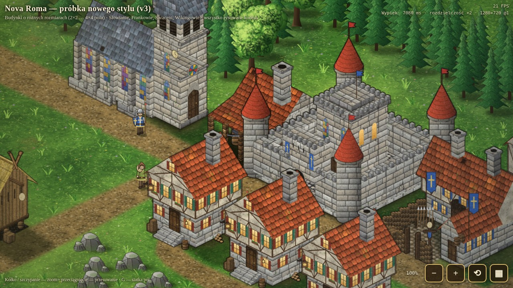

# Próbka nowego stylu graficznego (prototyp, v4 — komplet budynków wszystkich nacji)

Samodzielny prototyp — **nie zmienia gry** (`Nova_Roma.html`). Pokazuje, jak wygląda render w stylu Settlers IV / Twierdzy / AoE2 bez żadnych
plików graficznych: wszystko jest rysowane kodem i wypiekane do sprite'ów. Od v4 narysowany jest **każdy budynek z katalogu gry
(`Data.BUILDINGS`) dla każdej z czterech nacji — 87 sprite'ów** — z własnym obrysem (2×2 … 4×4 pola).

## Jak oglądać
- `grafika_prototyp.html` — otwórz w przeglądarce. Kółko / szczypanie / przyciski `+` `−` — zoom (30–180% widoku domyślnego),
  przeciągnięcie — przesuwanie, `⟲` — widok domyślny, `▦` (klawisz `G`) — siatka pól z obrysami budynków i ich rozmiarami.
- Arkusze budynków (z obrysem w polach i podpisem): `#sheet-r-franks`, `#sheet-r-saracens`, `#sheet-r-vikings`, `#sheet-r-slavs` (jedna nacja),
  `#sheet-r` (wszystkie w jednej skali); `?cols=4` — liczba kolumn. Wypiekane są tylko sprite'y potrzebne w danym widoku.
- Pojedyncze budynki: `?sprite=franks_keep,vikings_ship&zs=2` (nazwa sprite'a = `<nacja>_<id z gry>`).
- Parametry adresu: `?q=1|2` (rozdzielczość wypieku; domyślnie 2), `?z=2.4` (zoom), `?grid=1`, `?cx=26&cy=8` (środek kamery w polach), `?all=1` (wypiekaj wszystko), `?lint=1` (kontrola artefaktów), `?nowear=1` (bez śladów zużycia).
- Podglądy: `podglad/*.jpg` (odświeża je `sh podglady.sh`).

## Co jest w v4
1. **Komplet budynków:** Frankowie 24, Saraceni 23, Wikingowie 20, Słowianie 20 (tabele niżej) — każdy pod swój obrys, z rekwizytami pasującymi do funkcji
   (tartak z piłą, kopalnia z torami i wózkiem, kaszarnia ze stępą, garbarnia z kadziami, qanat z szybami, okręt z tarczami, …).
2. **Koniec „halucynacji" — budynki składane z brył, nie malowane „na oko".** Każdy budynek to zbiór brył (`src/26_build.js`, klasa `Build`):
   prostopadłościany, walce, dachy dwu-/czterospadowe/pulpitowe, kopuły, rekwizyty — każda z własnym obrysem w przestrzeni.
   - **kolejność rysowania ustala program** (nie autor): relacja „bliżej/dalej widza" + sortowanie topologiczne z przełamywaniem cykli,
     więc ściany nie „wchodzą" jedna w drugą, a dach, komin i rekwizyty są zawsze we właściwej warstwie;
   - **cienie** liczone z sumy brył (zakładki nie ciemnieją podwójnie);
   - **okna i drzwi układa `facade()`**: równe odstępy, nie nachodzą na narożniki ani na siebie, liczba okien jest ograniczona szerokością ściany;
   - **kontrola jakości `?lint=1`** (`node lint.js [nazwy]`): przenikanie się brył, zła kolejność, okna poza ścianą / nachodzące / zbyt gęste (>50% szerokości),
     elementy wystające poza obrys, ucięcie na brzegu płótna, nierozwiązywalne cykle głębi. **Wszystkie 87 budynków przechodzi z 0 ostrzeżeń.**
3. **Uwagi z przeglądu zrealizowane:** u Franków 2–3 okna na ścianę (ciemne szyby, jeden kolor okiennic, ryglówka dopasowana do okien), kościół przeprojektowany
   (nawa + przypory + 3 witraże + prosta wieża z iglicą — bez zegara, rozety i pinakli), u Wikingów kościół słupowy (nawa, nawy boczne, wieża), u Słowian „Święty krąg".
4. **Okrągła cegła na okrągłych bryłach** (wieże, studnie, kopuły bębnów, młyn): tekstura jest mapowana walcowo (`cylTexture`) — cegły zwężają się ku krawędziom
   i układają w łuki, zamiast płaskiej siatki jak na ścianach.
5. **Zużycie dopasowane do materiału:** łaty napraw na ciemnych deskach i gontach są tylko trochę jaśniejsze (nie rażą), na jasnych — wyraźne.
6. **Kotwice dymu i wejścia w sprite'ach:** `sprite.smoke` (kominy / otwory dymne — animowany dym w widoku) i `sprite.doors` (położenie drzwi), wyeksportowane do `katalog_budynkow.json`.

## Budynki (pola; nazwy sprite'ów = `<nacja>_<id>`)
### Frankowie — kamień, ryglówka, dachówka / łupek
| id | Budynek | Obrys | Uwagi |
|---|---|---|---|
| keep | Dwór (zamek) | 4×4 | mur kurtynowy, 4 baszty z cegłą walcową, brama z kratą, donżon, stajnia, studnia |
| hut | Chata | 2×2 | kamienny parter, piętro z ryglówki z nawisem, schody |
| temple | Kościół | 4×2 | nawa z witrażami i przyporami, wieża z iglicą |
| woodcutter / forester / hunter | Chaty drwala, leśnika, myśliwego | 2×2 | stosy kłód, grządka z sadzonkami, poroże i skóry |
| sawmill | Tartak | 3×2 | wiata, piła ramowa, kłody i deski |
| store | Skład | 3×2 | kamień + ryglówka, brama, worki |
| dairy / orchard / watercarrier / market | Mleczarnia, Sad, Chata nosiwody, Targ | 2×3 / 3×3 / 2×2 / 3×3 | bańki i sery; jabłonie w płocie; studnia z daszkiem; stragany i krzyż targowy |
| quarry / mill / farm / bakery | Kamieniołom, Młyn, Farma, Piekarnia | 3×3 / 3×3 / 4×3 / 2×3 | żuraw i bloki; wiatrak + dom młynarza; pole, stodoła; piec chlebowy |
| ironmine / coalmine / smelter / toolforge / armory | Kopalnie, Huta, Kuźnia narzędzi, Zbrojownia | 3×3 / 3×3 / 3×3 / 2×3 / 3×2 | wejście w ramie z bali, tory, wózek; palenisko; stojaki z bronią |
| vineyard / winery / barracks | Winnica, Winiarz, Koszary | 3×3 / 2×3 / 3×3 | rzędy winorośli; prasa i beczki; dziedziniec z palisadą |

### Saraceni — piaskowiec, kopuły, mozaika, markizy
| id | Budynek | Obrys | Uwagi |
|---|---|---|---|
| keep | Dwór (pałac) | 4×4 | mur z basztami i kopułami, brama-pishtak, wielka turkusowa kopuła, minaret, fontanna |
| hut / woodcutter / forester / hunter | Domy | 2×2 | płaski dach z attyką, mozaika, markiza, pergole z liści |
| sawmill / dairy / orchard / watercarrier / market / store | | 3×2 / 2×3 / 3×3 / 2×2 / 3×3 / 3×2 | sabil z kopułą; stragany pod pasiastymi płachtami; magazyn ze świetlikiem |
| temple | Meczet | 3×3 | kopuła na bębnie, iwan, dziedziniec z arkadą i fontanną, minaret |
| claypit / dategrove / incensewood / incense | Glinianka, Gaj daktylowy, Las kadzidlany, Wytwórnia kadzidła | 3×3 / 3×3 / 3×3 / 2×3 | skarpa i cegły schnące; palmy i kanał; kadzielnice |
| cotton / weaver / pottery / qanat | Plantacja bawełny, Tkalnia, Garncarnia, Qanat | 3×3 / 2×3 / 2×3 / 3×2 | krzewy z torebkami; krosno; piec z żarem; szyby i basen |
| bathhouse / caravanserai / guardpost | Łaźnia, Karawanseraj, Strażnica | 3×3 / 4×3 / 2×2 | trzy kopuły; dziedziniec i wielbłądy; wieża z blankami |

### Wikingowie — ciemne drewno, darń na dachach, smocze łby, tarcze
| id | Budynek | Obrys | Uwagi |
|---|---|---|---|
| keep | Dwór jarla | 4×4 | palisada z bramą ze smoczymi słupami, hala ze smoczymi łbami, dom gościnny, spichlerz na palach |
| hut / woodcutter / forester / hunter | Chaty | 2×2 | zrąb z wystającymi końcami bali, darń, suszarnie |
| sawmill / dairy / orchard / watercarrier / market / store | | 3×2 / 2×3 / 3×3 / 2×2 / 3×3 / 3×2 | kamień runiczny na targu |
| temple | Kościół słupowy | 3×3 | nawa pod gontem, nawy boczne, wieża z portalem, smocze łby, kamienie runiczne |
| fisherhut / peatmine / charburner / mead | Chata rybaka, Kopalnia darniowa, Wypalarka węgla, Miodosytnia | 2×2 / 3×3 / 3×3 / 2×3 | łódź na brzegu; torfowisko; mielerz z żarem; kadzie |
| dock / ship | Przystań, Okręt | 4×2 / 4×2 | pomost na palach z żurawikiem; okręt z tarczami, żaglem i smoczą głową |
| smelter / toolforge / armory | Huta, Kuźnia, Zbrojownia | 3×3 / 2×3 / 3×2 | piec szybowy z żarem; otwarta kuźnia; rzędy tarcz |

### Słowianie — zrąb, strzecha, koniki na kalenicy, drewniane bożki
| id | Budynek | Obrys | Uwagi |
|---|---|---|---|
| keep | Gród (dwór) | 4×4 | wał z bali z częstokołem, brama z nadbudówką, dwupiętrowy dwór, dom gościnny, studnia-żuraw, bożek |
| hut / woodcutter / forester / hunter | Chaty | 2×2 | ganek pod pulpitowym daszkiem, sznury cebuli i ziół |
| sawmill / dairy / orchard / watercarrier / market / store | | 3×2 / 2×3 / 3×3 / 2×2 / 3×3 / 3×2 | studnia-żuraw; targ z bożkiem; spichlerz na palach z wciągarką |
| temple | Kapliczka (Święty krąg) | 3×3 | kopiec z kręgiem rzeźbionych bożków, ołtarz z ogniem |
| gatherer / field / kasha / bartnik | Zbieracz, Pole stałe, Kaszarnia, Barć | 2×2 / 3×3 / 2×3 / 3×3 | grzyby i jagody; zagony i snopki; stępa; kłody bartne wśród sosen |
| waxery / trapper / tannery / sauna | Woskarnia, Łowca futer, Garbarnia, Bania | 2×3 / 2×2 / 2×3 / 2×2 | pasieka i kocioł; ramy ze skórami; kadzie; para i dym |

## Zasady techniczne
- **Skala pól:** jednostka = 1 pole (128 px logicznych szerokości, rzut dimetryczny 2:1). Układ sprite'a: środek obrysu = (0,0), `x` w prawo-dół, `y` w lewo-dół, `z` w górę.
  Środek obrysu budynku z północnym rogiem (i, j) leży w polu (i + szer/2, j + wys/2).
- **Rozdzielczość `RES`:** domyślnie 2× (ostre duże budynki także po przybliżeniu); `?q=1` — lżejsza wersja (około połowa pamięci).
- **Elementy architektoniczne** (`src/30_buildings.js`): drzwi, okna (prostokątne, łukowe, witrażowe), ryglówka, komin, schody, markizy, kopuły, minarety…
  **Zestaw rekwizytów** (`src/27_kit.js`): tartaczne, górnicze, rolnicze, targowe, wojskowe; **domy** (`src/28_house.js`): wspólny szkielet z dachem, kominem i piętrem.
- **Ślady życia** (`src/25_wear.js`): ziarno, plamy, zacieki, pęknięcia, łaty napraw, mech, odpadający tynk, brakujące dachówki — deterministyczne.
- **Teren:** kafle 512×512 px logicznych wypiekane na żądanie; cienie i place nieruchomych obiektów wypiekane razem z terenem.
- **Ludzie:** ~70 px wysokości przy zoomie domyślnym, widok z przodu i z tyłu, 2 klatki chodu, strój zależny od nacji i roli.

## Katalog dla integracji (`katalog_budynkow.json`)
Generuje go `node katalog.js`. Dla każdego `nacja → id`: nazwa sprite'a, nazwa PL, `obrys` [szer, wys] w polach, `wejscie` (strona `S`/`E` i punkt w polach względem środka),
`dym` (lista kotwic [x, y, z] animowanego dymu) i rozmiar sprite'a `{w, h, ax, ay}` w px logicznych (`ax, ay` = środek obrysu na ziemi).

## Pomiary (Chromium headless, render programowy, bez GPU)
Patrz sekcja „Pomiary" na końcu — liczby poniżej to wypiek **jednej nacji** (tyle potrzebuje gra) i wszystkich czterech.

## Co trzeba zmienić w grze, żeby użyć tych sprite'ów
Dziś w `Nova_Roma.html` budynek ma 1 pole (poza Zamkiem 2×2: `size = id === 'keep' ? 2 : 1` w kilku miejscach). Potrzebne:
- `footprint: [w, h]` w `Data.BUILDINGS` (z katalogu) i użycie go w kolizjach, obsadzaniu pól, podglądzie budowy, drogach/„adjacency", AI botów;
- wejścia (punkt dojścia pracowników) z katalogu zamiast „środka pola";
- sortowanie głębi z prostokątami obrysów (jest w `src/90_main.js: sortDrawables`);
- wypiek sprite'ów **tylko wybranej nacji** przy starcie z paskiem postępu (`BAKED.<nacja>_<id>`, funkcja `wantedSprites()` pokazuje wzorzec);
- animowany dym z kotwic `sprite.smoke` (emisja tylko dla widocznych budynków — `drawFrame` w `src/90_main.js`).
